# Proyecto Final — Arquitecto Cloud
**Sistemas Operativos 750001C | Semestre 1 – 2026**
**Universidad del Valle**

---

## Equipo

| Nombre | Código | Rol |
|--------|--------|-----|
| Diana Marcela Henao Betancourt | 202478024 | Arquitecta Cloud (Responsable de todos los componentes)|

**Grupo asignado:** Grupo 1  
**Distribución gráfica:** Ubuntu 24.04 LTS  
**Distribución consola:** Debian 13.5  
**Imagen Docker base:** ubuntu:24.04

---

## Componente 1: Virtualización con Linux

**Distribuciones instaladas:** VM Gráfica + VM Consola  
**Herramienta:** VirtualBox / VMware

### Evidencias
- Evidencia instalacion VM grafica
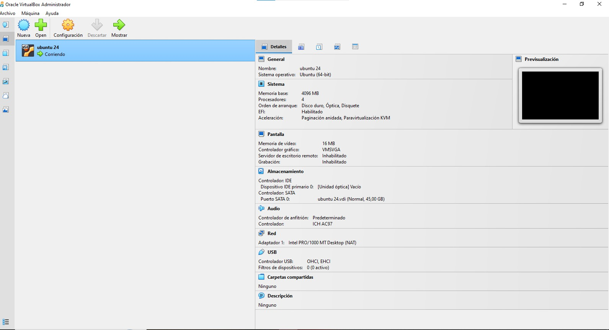

- Evidencia instalacion VM Consola
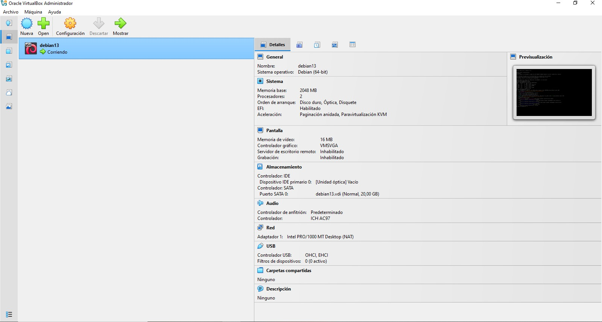

- Captura particionamiento VM grafica (lsblk)
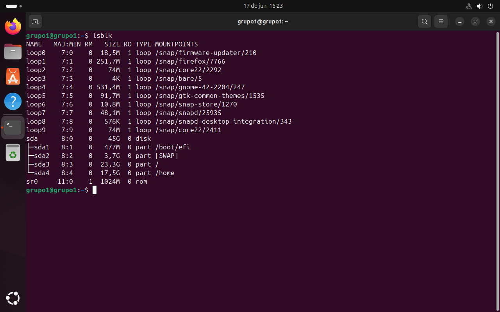

- Captura particionamiento VM Consola (lsblk)
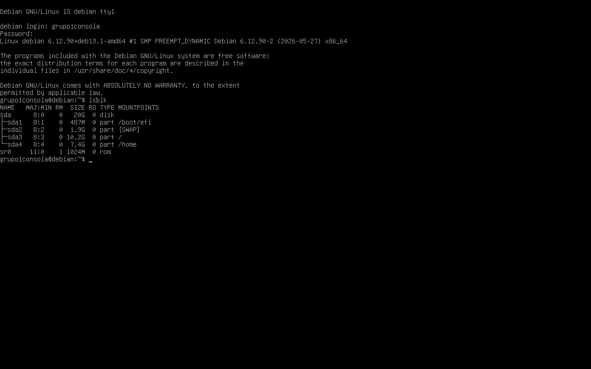

- Captura configuración de red VM consola
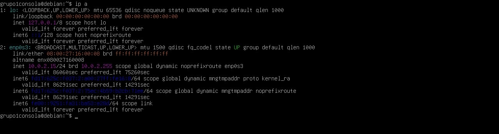

- Captura prueba SSH funcional
  No hay captura debido a que se trabajo en computador de la Universidad, por tanto no permitia la conexion adaptador puente, todo el proyecto se trabajo bajo la configuracion NAT 

### Comandos principales
```bash
ip a                          # Ver interfaces de red (hecho)
lsblk                         # Ver particiones (hecho)
ssh usuario@ip_vm_consola     # Conectar por SSH (no se hizo su realizacion)
```

---

## Componente 2: Contenedores Docker

**Servicios implementados:**
- Frontend: Nginx sirviendo HTML estático (puerto 80)
- Backend: Python HTTP (puerto 5000)

### Estructura de archivos
```
docker/
├── frontend/
│   ├── Dockerfile.frontend
│   └── index.html
├── backend/
│   ├── Dockerfile.backend
│   └── server.py
└── docker-compose.yml
```

### Evidencias
- Capturas Doker files
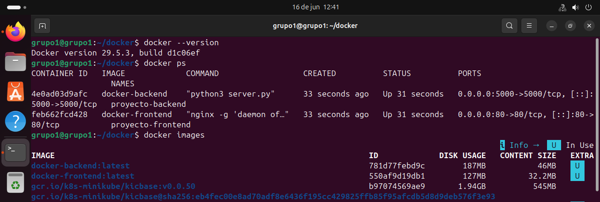

- Captura `docker compose up -d`


- Captura navegador accediendo al frontend
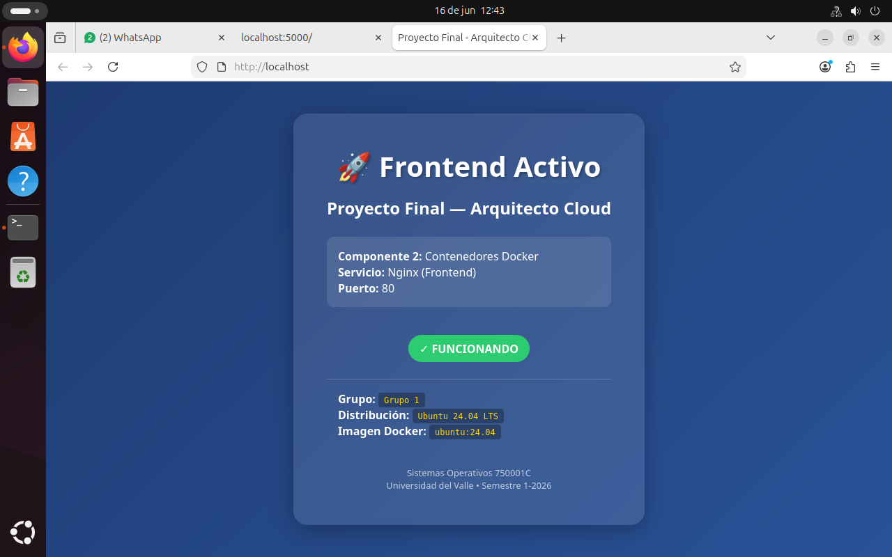

- Captura `curl http://localhost:5000`


### Comandos principales
```bash
docker compose up -d (hecho)
docker ps (hecho)
docker images (hecho)
curl http://localhost (hecho)
curl http://localhost:5000 (hecho)
```

---

## Componente 3: Orquestación con Kubernetes

**Herramienta:** Minikube

### Manifiestos
- `deployment.yaml` — Nginx con 2 réplicas
- [deployment.yaml](laboratorio_parte2/deployment.yaml)

- `service.yaml` — NodePort en puerto 30080
- [service.yaml](laboratorio_parte2/service.yaml)

### Evidencias
- Captura `minikube start`
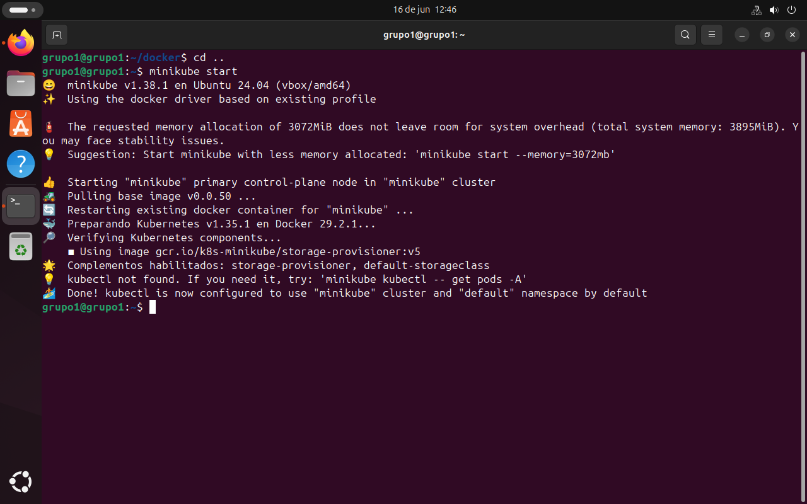
- Captura `kubectl get pods`
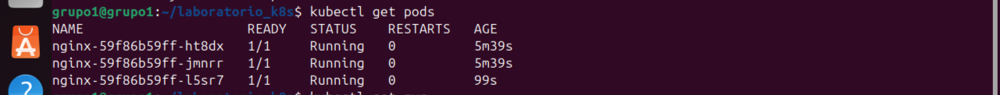
- Captura `kubectl get svc`
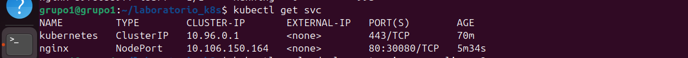
- Captura acceso desde navegador
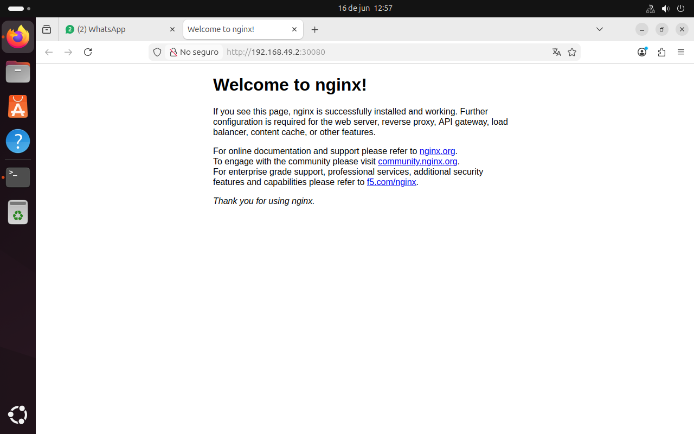
- Captura escalado a 3 réplicas
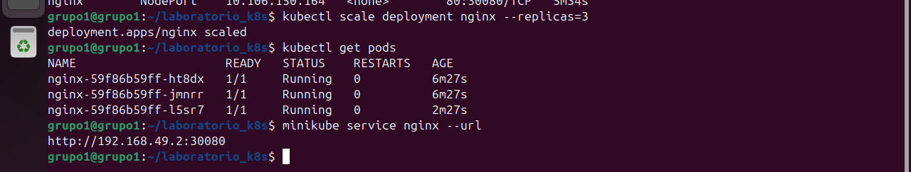

### Comandos principales
```bash
minikube start
kubectl apply -f deployment.yaml
kubectl apply -f service.yaml
kubectl get pods
kubectl scale deployment nginx --replicas=3
minikube service nginx --url
```

---

## Componente 4: Sitio Web de Documentación

**URL del sitio:** [https://diamahebe.github.io/Proyecto-Final-SO-grupo-1/]
**Video YouTube:** [https://www.youtube.com/watch?v=lT6z8g4Xz1M]

### Secciones del sitio
- Home: introducción y objetivos
- Equipo: integrantes con fotos y roles
- Componentes: descripción, capturas y comandos de cada uno
- Conclusiones: aprendizajes, dificultades y recomendaciones

---

## Diagrama de Arquitectura

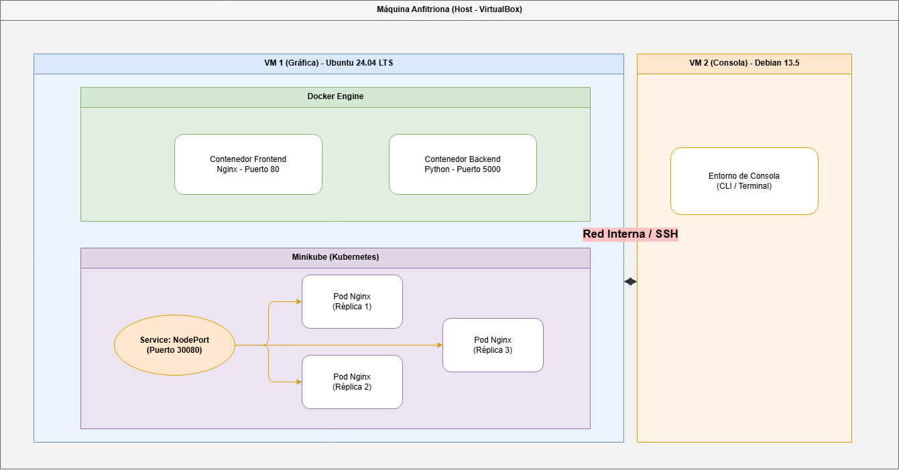

---

## Conclusiones

1. [Aprendizaje principal]
Aprendí el proceso completo de cómo funcionan los servidores hoy en día. Entendí cómo crear primero una computadora virtual "vacía", luego cómo guardar y separar mis programas usando Docker (como en cajitas), y por último, cómo usar Kubernetes para controlar que esos programas funcionen solos y automáticamente.
2. [Dificultad encontrada y cómo se resolvió]
El mayor problema fue que el internet de la universidad tenía bloqueos de seguridad que no dejaban conectar mis máquinas virtuales de forma normal.
3. [Recomendación para futuros proyectos]
Para la próxima vez, recomiendo tener listos y escritos desde antes los archivos de configuración (los manifiestos) para Kubernetes. También es muy importante revisar que los puertos de conexión estén libres antes de empezar, para que no salgan errores cuando intentemos crear más copias de la aplicación..
---

*Proyecto desarrollado para la asignatura Sistemas Operativos 750001C — Semestre 1, 2026*
